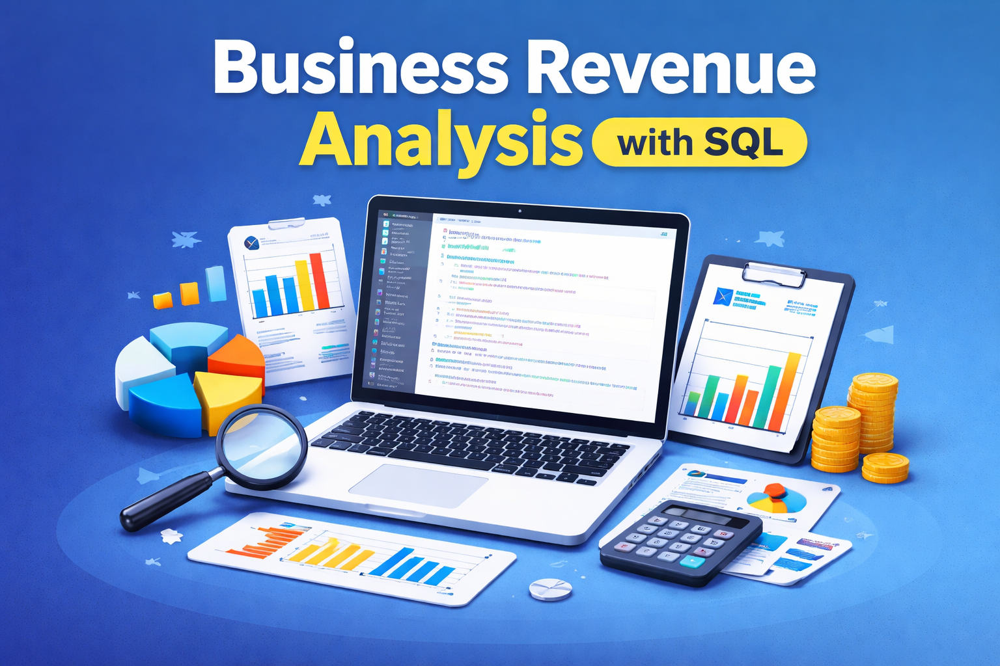

# 📊 Business Revenue Analysis (SQL)

📊 SQL Revenue Analysis Project
Dataset

The analysis is performed on an invoice table containing:

InvoiceId

CustomerId

InvoiceDate

BillingCountry

Total

1. Top 3 Countries by Total Revenue
WHY

Identify the highest revenue-generating countries to support macro-level investment decisions, market prioritization, and regional strategy.

LOGIC

Group invoices by country

Aggregate total revenue per country

Sort in descending order

Return the top 3 countries

SQL
select BillingCountry,SUM(Total) as total_revenue FROM invoice
group by BillingCountry
order by total_revenue DESC
LIMIT 3;

2. Top 5 Customers by Revenue in 2022
WHY

Identify the most valuable customers within a specific year to evaluate key relationships, customer concentration, and potential retention focus.

LOGIC

Filter invoices to the 2022 calendar year

Group by customer

Aggregate total spend per customer

Rank and return the top 5 customers

SQL

select CustomerId,SUM(TOTAL) FROM invoice
WHERE YEAR(INVOICE_DATE)=2022
group by CustomerId
ORDER BY 2 DESC
LIMIT 5;

3. High vs Low Revenue Countries (Dynamic Thresholding)
WHY

Classify countries into performance tiers to support regional segmentation, reporting, and strategic decision-making without relying on arbitrary thresholds.

LOGIC

Aggregate total revenue per country

Compute the global average of country-level revenue

Label each country as High Revenue or Low Revenue based on whether it exceeds the global average

SQL - CTE

WITH country_total AS (
  SELECT
    BillingCountry,
    SUM(Total) AS country_revenue
  FROM invoice
  GROUP BY BillingCountry
)

SELECT
  BillingCountry,
  country_revenue,
  CASE
    WHEN country_revenue >
         (SELECT AVG(country_revenue) FROM country_total)
    THEN 'High Revenue'
    ELSE 'Low Revenue'
  END AS revenue_group
FROM country_total;

4. Five Invoices Closest to the Global Average
WHY

Identify “typical” transactions to support benchmarking, data quality checks, and representative examples for reporting or analysis.

LOGIC

Calculate the global average invoice total

Measure the absolute difference between each invoice and the global average

Sort by smallest difference

Return the five closest invoices

SQL
SELECT
  InvoiceId,
  Total,
  ABS(Total - (SELECT AVG(Total) FROM invoice)) AS diff_from_global_avg
FROM invoice
ORDER BY diff_from_global_avg ASC
LIMIT 5;

🧠 Skills Demonstrated

Aggregations (SUM, AVG)

Grouping and filtering

Common Table Expressions (CTEs)

Scalar subqueries

Business-driven SQL logic

Clean, readable query structure

✅ Notes on SQL Dialect

Queries are written to run in MySQL

Date filtering is written in a portable format

CTE usage is structured for clarity and maintainability
