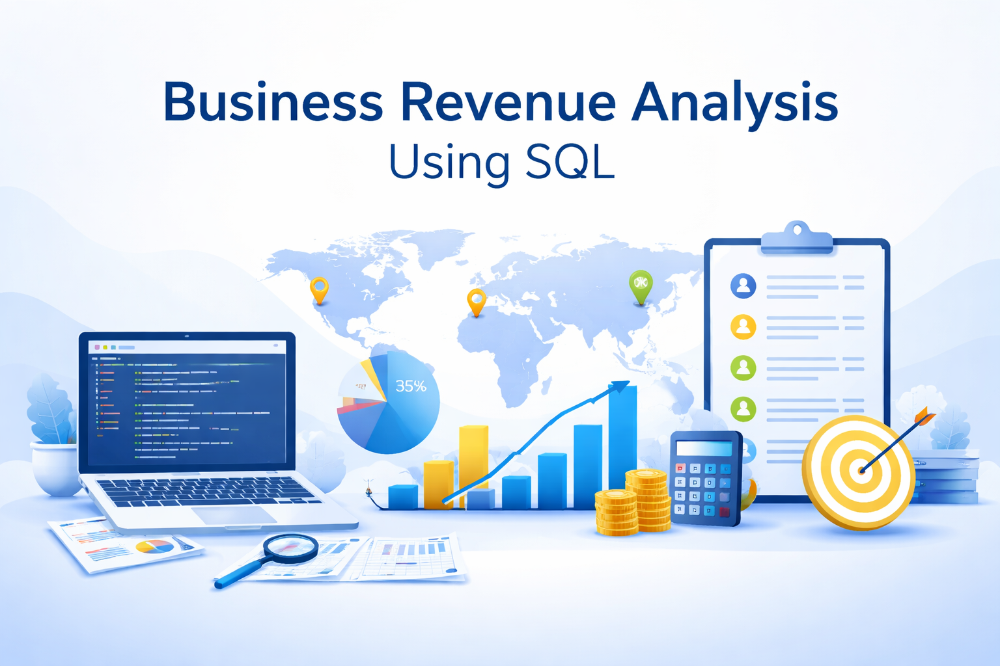

# 📊 Business Revenue Analysis using SQL



---

## 📌 Project Overview

This project performs structured **business revenue analysis** using SQL on invoice-level transactional data.

The objective is to transform raw invoice data into meaningful business insights through aggregation, segmentation, ranking, and time-based analysis.

The analysis focuses on identifying:

- High-performing countries  
- Top revenue-generating customers  
- Revenue distribution patterns  
- Market performance benchmarking  
- Monthly revenue trends  
- Country-level revenue contribution  

This project demonstrates practical SQL skills applied to real-world business questions.

---

## 🎯 Business Questions Answered

1. Which countries generate the highest revenue?
2. Who are the top customers in a specific year?
3. Which countries perform above or below the global average?
4. What does a “typical” invoice look like?
5. How does revenue trend over time?
6. What percentage of total revenue comes from each country?

---

## 🛠️ Tools & Technologies

- SQL (MySQL)
- MySQL Workbench
- CSV (Dataset Export)
- GitHub

---

## Repository Structure

```
Business-Revenue-Analysis-SQL/
│
├── README.md
├── sql_queries.sql
├── dataset/
│   └── invoice.csv
└── BusinessAnalysis.png
```

---

# 📈 SQL Analysis

---

## 1️⃣ Top 3 Countries by Total Revenue

**Business Purpose:**  
Identify major revenue-driving countries for strategic investment and focus.

**SQL Logic:**  
Group by country -> Sum revenue -> Sort descending -> Limit top 3.

```sql
select BillingCountry, sum(Total) as Total_Revenue
from invoice
group by BillingCountry
order by Total_Revenue desc
limit 3;
```

---

## 2️⃣ Top 5 Customers by 2022 Revenue

**Business Purpose:**  
Evaluate strongest customer relationships within a specific year.

**SQL Logic:**  
Filter by year -> Group by customer -> Sum revenue -> Rank top 5.

```sql
select CustomerId, sum(Total) as Revenue_2022
from invoice
where year(InvoiceDate) = 2022
group by CustomerId
order by Revenue_2022 desc
limit 5;
```
---

## 3️⃣ High vs Low Revenue Countries (Dynamic Benchmarking)

**Business Purpose:**  
Segment countries based on performance compared to the global average revenue.

**SQL Logic:**  
Compute country totals -> Calculate global average -> Classify using CASE.

```sql
with country_total as (
    select BillingCountry, sum(Total) as C_Total
    from invoice
    group by BillingCountry
)

select BillingCountry,
       sum(Total) as C_Total,
       case
           when sum(Total) > (
               select avg(C_Total) from country_total
           )
           then 'High Revenue'
           else 'Low Revenue'
       end as Revenue_Group
from invoice
group by BillingCountry;
```
---

## 4️⃣ 5 Invoices Closest to Global Average

**Business Purpose:**  
Identify “typical” transactions for benchmarking and analysis.

**SQL Logic:**  
Calculate global average -> Measure difference -> Sort by smallest deviation.

```sql
select *,
       abs(Total - (select avg(Total) from invoice)) as Diff_From_Global_Avg
from invoice
order by Diff_From_Global_Avg asc
limit 5;
```

---

## 5️⃣ Monthly Revenue Trend Analysis

**Business Purpose:**  
Understand revenue seasonality and performance patterns over time.

**SQL Logic:**  
Extract year & month -> Aggregate revenue -> Order chronologically.

```sql
select 
    year(InvoiceDate) as Year,
    month(InvoiceDate) as Month,
    sum(Total) as Monthly_Revenue
from invoice
group by Year, Month
order by Year, Month;
```

---

## 6️⃣ Revenue Contribution (%) by Country

**Business Purpose:**  
Measure each country’s contribution to total company revenue.

**SQL Logic:**  
Sum revenue per country -> Divide by total revenue -> Convert to percentage.

```sql
select 
    BillingCountry,
    sum(Total) as Country_Revenue,
    round(
        (sum(Total) / (select sum(Total) from invoice)) * 100,
        2
    ) as Revenue_Percentage
from invoice
group by BillingCountry
order by Revenue_Percentage desc;
```

---

# 📊 SQL Concepts Demonstrated

- Aggregation (SUM, AVG)
- GROUP BY
- Filtering with WHERE
- Subqueries
- Common Table Expressions (CTE)
- CASE Statements
- Ranking & Limiting
- Percentage Calculations
- Time-based Analysis

---

# 🚀 Project Outcome

This project demonstrates the ability to:

- Translate business problems into SQL queries
- Perform structured revenue analysis
- Apply analytical thinking
- Write clean and organized SQL
- Present results professionally on GitHub

This is a complete mini business analytics project — not just SQL practice.

